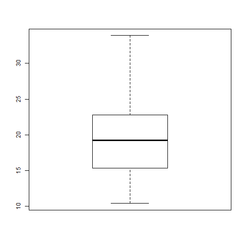

### Objective: Find the average miles/gallon for automobiles in the mtcars data set.
Load mtcars data and observe the number of variables in mtcars data.

```r
data(mtcars)
str(mtcars)
```

```
## 'data.frame':	32 obs. of  11 variables:
##  $ mpg : num  21 21 22.8 21.4 18.7 18.1 14.3 24.4 22.8 19.2 ...
##  $ cyl : num  6 6 4 6 8 6 8 4 4 6 ...
##  $ disp: num  160 160 108 258 360 ...
##  $ hp  : num  110 110 93 110 175 105 245 62 95 123 ...
##  $ drat: num  3.9 3.9 3.85 3.08 3.15 2.76 3.21 3.69 3.92 3.92 ...
##  $ wt  : num  2.62 2.88 2.32 3.21 3.44 ...
##  $ qsec: num  16.5 17 18.6 19.4 17 ...
##  $ vs  : num  0 0 1 1 0 1 0 1 1 1 ...
##  $ am  : num  1 1 1 0 0 0 0 0 0 0 ...
##  $ gear: num  4 4 4 3 3 3 3 4 4 4 ...
##  $ carb: num  4 4 1 1 2 1 4 2 2 4 ...
```

---

### Look at 'mpg' variable in mtcars data.
Observe the Five-number summary of 'mpg' variable.

```r
summary(mtcars$mpg)
```

```
##    Min. 1st Qu.  Median    Mean 3rd Qu.    Max. 
##    10.4    15.4    19.2    20.1    22.8    33.9
```

---

### Boxplot
Observe if there is any outlier.

```r
boxplot(mtcars$mpg)
```

 

---

### Histogram of 'mpg' variable

```r
hist(mtcars$mpg, xlab="Miles per gallon", col="lightblue", main="Histogram")
```

 

---
